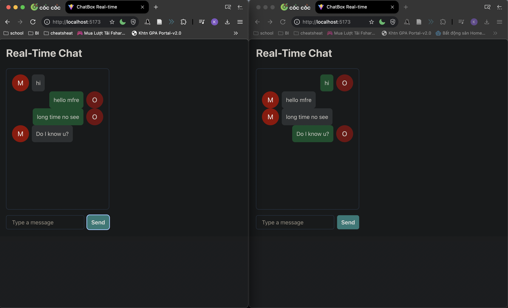

# ChatBot Real-time

I built a real-time basic chatbox application using Socket.io, Express, React.js, and Chakra UI, with the project set up via Vite



## Features

- Real-time chat
- Multiple users can connect and chat with each other
- User can send messages
- User can see other users' messages
- User can see other users' avatars

## Technologies

- Socket.io
- Express
- React.js
- Chakra UI
- Vite

## Installation
```
cd chat-backend
npm install
cd chat-frontend
npm install
```
## Usage
```
cd chat-backend
node server.js

cd chat-frontend
npm run dev
```
Then open http://localhost:5173 in your browser (multiple tabs for chat)

